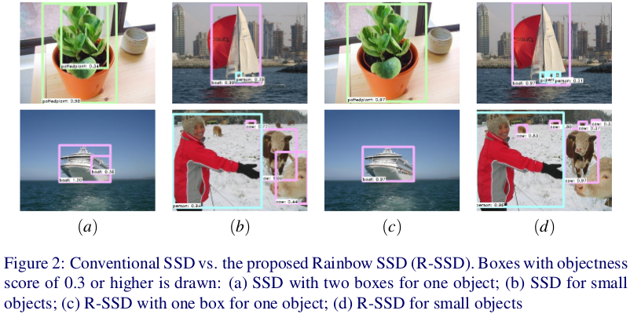

# Enhancement of SSD by concatenating feature maps for object detection

By [Jisoo Jeong](http://mipal.snu.ac.kr/index.php/Jisoo_Jeong), [Hyojin Park](http://mipal.snu.ac.kr/index.php/Hyojin_Park), [Nojun Kwak](http://mipal.snu.ac.kr/index.php/Nojun_Kwak)

## Intoroduction

### The conventional SSD has a couple of points to be supplemented
   * Each layer in the feature pyramid is used independently (the same object can be detected in multiple scales)
   * Small objects are not detected well (this is not the problem only for SSD)

### We tackle this problems as follows
   * The classifier network is implemented considering the relationship between layers in the feature pyramid
   * The number of channels in a layer is increased efficiently
   * The proposed network is suitable for sharing weights in the classifer network for different scales, resulting in a single classifier network

### For more details, please refer to our [arXiv paper](https://arxiv.org/abs/1705.09587)

